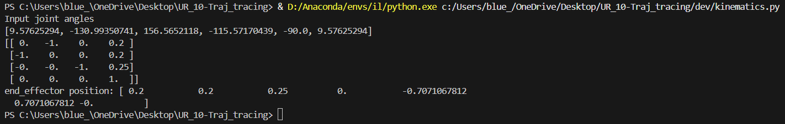

# UR10 Helical Trajectory Tracing

A small codebase and associated data for commanding a Universal Robots UR10 arm (in NVIDIA Isaac Lab) to trace a 3D Archimedean helical spiral, recording and visualizing the resulting joint-angle trajectories.

---

## 🎯 Project Overview

- **Objective:**  
  Trace a three-dimensional Archimedean helical spiral with the UR10 arm.  
- **Kinematics:**  
  - Derived **analytical** forward- and inverse-kinematics for all 6 DOF.  
  - Decouple wrist (joints 4–6) via a spherical-wrist assumption.  
- **Control Loop:**  
  1. Generate helix waypoints in task space.  
  2. Solve IK for each waypoint → joint angles.  
  3. Command the UR10 in Isaac Sim until end-effector reaches within tolerance.  
  4. Record joint angles at each step.  


## 🚀 Installation & Dependencies

1. **Install NVIDIA ISAAC Sim and ISAAC lab**
    ```bash
    https://isaac-sim.github.io/IsaacLab/main/source/setup/installation/pip_installation.html
    # official documentation for isaacsim and isaaclab installation by NVIDIA


2. **Clone this repo**  
   ```bash
   git clone https://github.com/Deepak-Mutta/UR_10-Traj_tracing.git
   cd UR_10-Traj_tracing


## Directory Structure
```text
.
├── README.md
├── dev
    └── kinematics.py           # sympy implementation for forward kinematics 
    └── inverse_kinematics.py   # sympy implementation for inverse kinematics
    └── fk_test.py              # test script to verify forward kinematics in simulation
    └── ik_test.py              # test script to verify inverse kinematics in simulation
├── images
├── jointangles
├── archimedian_helical_spiral.py # generates and visualises the 3d trajectory in matplotlib
├── DH_frame_visualizer.py        # sets up the 3d scene in Isaaclab and visualises the DH frames
├── ik_spiral.py                  # script to make the UR10 arm follow the 3d trajectory
└── ht.m                          # Matlab script for forward and inverse kinematics 
```

## DH parameters
Visualizing the joint frames assigned as per the DH parameters


Visualizing bare frames over 3d cartesian space


## Kinematics & Trajectory

Sympy execution of forward kinematics with random joint angles as input


Sympy execution of inverse kinematics with a random pose as input to calculate joint angles


Archimedean Helical trajectory
")

## execution

Traced Helical trajectory
")

**Watch the video on YouTube**  
[Universal Robots UR10: 3D Trajectory Tracing Demo in NVIDIA ISAAC Lab](https://www.youtube.com/watch?v=oENpnQvfFkQ)